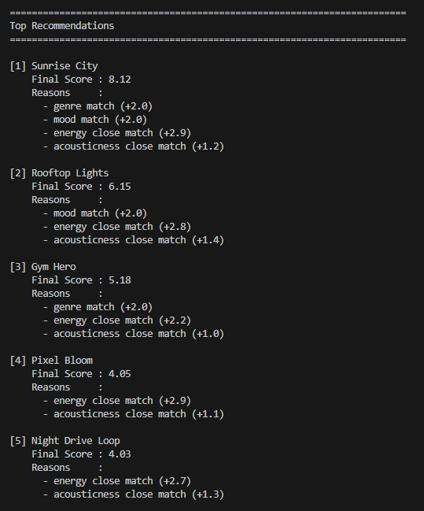
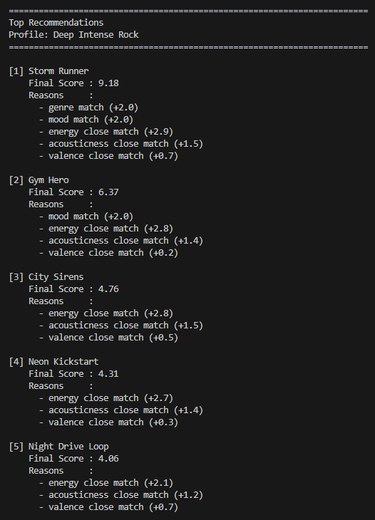
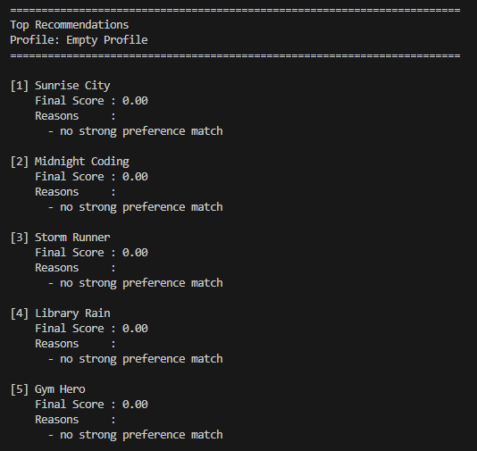
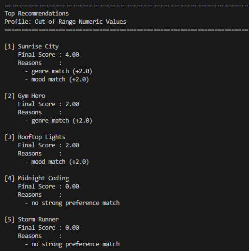
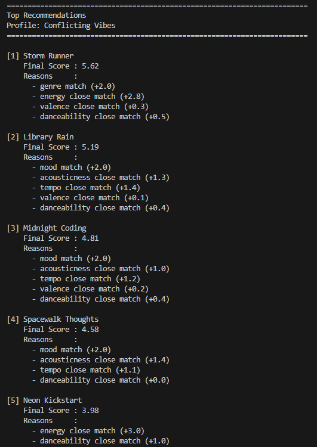
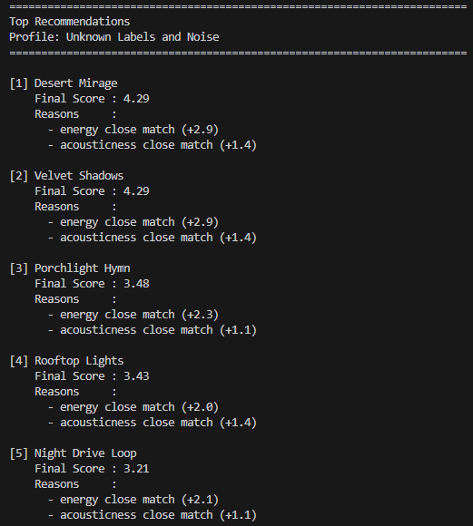

# 🎵 Music Recommender Simulation

## Project Summary

This project builds a small, explainable music recommender.
It reads songs from `data/songs.csv`, scores each song against a user profile, and returns the top matches.
The main goal is to test how scoring rules and feature weights shape recommendations.

---

## How The System Works

Explain your design in plain language.

Some prompts to answer:

- What features does each `Song` use in your system
  - For example: genre, mood, energy, tempo
- What information does your `UserProfile` store
- How does your `Recommender` compute a score for each song
- How do you choose which songs to recommend

You can include a simple diagram or bullet list if helpful.

Response: 
- My system will use the features genre, mood, energy, and acousticness. 
- My UserProfile object will store four fields, including favorite genre, favorite mood, target energy, and the user's acoustic preference. 
- The Recommender will use a formula multiplying each measurement of the four statistics (genre, mood, energy, acousticness) by the weights of these features. The weights of genre and mood will be much higher than the weights of energy and acousticness because they are the central factors that we are judging the song by. 
- Similar to real life, we will chooes songs to recommend by first calculating a score for the song using the formula mentioned above. Then, we will use a ranking rule to determine among the scored songs which one to recommend to the user first. 

Mermaid.js diagram: 
flowchart TD
    A[Input: User Preferences<br/>mood, genre, energy target, tempo target, weights] --> B[Load songs dataset]
    B --> C{More songs to evaluate?}
    C -->|Yes| D[Compute feature match values]
    D --> E[Calculate weighted score using configured weights]
    E --> F[Store song with its score]
    F --> C
    C -->|No| G[Sort songs by score descending]
    G --> H[Select top K songs]
    H --> I[Output ranked recommendations with title, artist, and score]

  Screenshot of the recommender output:

  

Algorithm Recipe: 
- The algorithm will first collect the user's song preferences. Then, the algorithm will go through the song dataset and exclude any irrelevant songs. For each song, we will compute a score for each feature that measures how much they match the user's preferences. Then, we will calculate a final weighted total score using the chosen point-weighting strategy. 

## Getting Started

### Setup

1. Create a virtual environment (optional but recommended):

   ```bash
   python -m venv .venv
   source .venv/bin/activate      # Mac or Linux
   .venv\Scripts\activate         # Windows

2. Install dependencies

```bash
pip install -r requirements.txt
```

3. Run the app:

```bash
python -m src.main
```

### Running Tests

Run the starter tests with:

```bash
pytest
```

You can add more tests in `tests/test_recommender.py`.

---

## Experiments You Tried

Use this section to document the experiments you ran. For example:

- What happened when you changed the weight on genre from 2.0 to 0.5
- What happened when you added tempo or valence to the score
- How did your system behave for different types of users

## Test Case Screenshots

### High-Energy Pop


### Chill Lofi


### Deep Intense Rock


### Empty Profile


### Out-of-Range Numeric Values


### Conflicting Vibes


### Unknown Labels and Noise


---

## Limitations and Risks

This recommender only has 18 songs, so it cannot represent all music tastes.
It does not use lyrics, language, culture, or listening history, so it misses important context.
The scoring can over-favor exact genre matches, which may reduce diversity and create repetitive results.
If a user gives unusual or mixed preferences, the system can still work, but the recommendations may feel less accurate.

---

## Reflection

This project helped me see how recommenders turn simple user inputs into ranked predictions. I learned that changing just one or two weights can strongly shift what appears at the top. I also saw how bias can show up when exact genre matching is weighted too heavily, because it can reduce diversity and create repetitive results. Testing edge cases showed me that even simple algorithms can feel useful, but they still need careful checks for fairness and balance.


---

## 7. `model_card_template.md`

Combines reflection and model card framing from the Module 3 guidance. :contentReference[oaicite:2]{index=2}  

```markdown
# 🎧 Model Card - Music Recommender Simulation

## 1. Model Name

Tune Recommender 

---

## 2. Intended Use

This system recommends 3 to 5 songs from a small catalog based on user preferences such as genre, mood, and audio features. It is designed for classroom learning and testing, not for real-world production use. It is for students who want to understand how scoring rules and feature weights affect recommendations.

---

## 3. How It Works (Short Explanation)

The model looks at each song's genre, mood, energy, acousticness, tempo, valence, and danceability. The user profile provides target preferences for those same traits. Each song gets points for exact matches on category features and partial points for numeric closeness. After scoring all songs, the model sorts them from highest to lowest and recommends the top results.

---

## 4. Data

This dataset has 18 songs in data/songs.csv. I AI-generated a few to expand the dataset. It now includes genres and moods like pop, lofi, rock, ambient, happy, chill, and intense, and it mostly reflects mainstream classroom-style listening preferences rather than the full range of global music taste.

---

## 5. Strengths

This recommender works best for clear profiles like High-Energy Pop, Chill Lofi, and Deep Intense Rock, and its simple scoring plus explanation strings make the rankings easy to understand.

---

## 6. Limitations and Bias

This recommender can over-favor exact genre matches, ignores context like lyrics and listening history, struggles with niche mixed tastes, and may create repetitive filter-bubble outputs that are less fair for users with different preference styles.

---

## 7. Evaluation

I evaluated the system by running multiple profiles including normal and edge cases, checking whether top songs matched the intended vibe, comparing explanation text to score drivers, and confirming expected behavior with tests and manual output checks.

---

## 8. Future Work

Next I would add diversity re-ranking, softer genre similarity, negative preferences, and feedback-based weight updates so recommendations become less repetitive and more adaptive to real user behavior.

---

## 9. Personal Reflection

I learned that even simple scoring logic can feel surprisingly personal, but I also saw how small weight choices can introduce bias, so human judgment still matters to review fairness, diversity, and whether the recommendations actually make sense.

